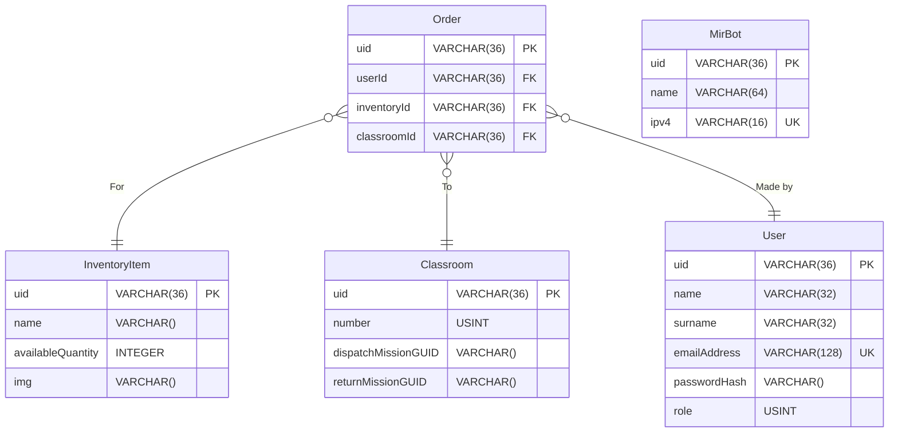

# mir-delivery

This project was created using the [Ktor Project Generator](https://start.ktor.io).

Here are some useful links to get you started:

- [Ktor Documentation](https://ktor.io/docs/home.html)
- [Ktor GitHub page](https://github.com/ktorio/ktor)
- The [Ktor Slack chat](https://app.slack.com/client/T09229ZC6/C0A974TJ9). You'll need
  to [request an invite](https://surveys.jetbrains.com/s3/kotlin-slack-sign-up) to join.

## ER Diagram


### Notes for ER Diagram
- `Classroom.dispatchMissionGUID` is the mission GUID to reach a classroom

## Features

Here's a list of features included in this project:

| Name                                                                   | Description                                                                        |
|------------------------------------------------------------------------|------------------------------------------------------------------------------------|
| [Routing](https://start.ktor.io/p/routing)                             | Provides a structured routing DSL                                                  |
| [Authentication](https://start.ktor.io/p/auth)                         | Provides extension point for handling the Authorization header                     |
| [Content Negotiation](https://start.ktor.io/p/content-negotiation)     | Provides automatic content conversion according to Content-Type and Accept headers |
| [kotlinx.serialization](https://start.ktor.io/p/kotlinx-serialization) | Handles JSON serialization using kotlinx.serialization library                     |
| [Exposed](https://start.ktor.io/p/exposed)                             | Adds Exposed database to your application                                          |

## Building & Running

To build or run the project, use one of the following tasks:

| Task                          | Description                                                          |
|-------------------------------|----------------------------------------------------------------------|
| `./gradlew test`              | Run the tests                                                        |
| `./gradlew build`             | Build everything                                                     |
| `buildFatJar`                 | Build an executable JAR of the server with all dependencies included |
| `buildImage`                  | Build the docker image to use with the fat JAR                       |
| `publishImageToLocalRegistry` | Publish the docker image locally                                     |
| `run`                         | Run the server                                                       |
| `runDocker`                   | Run using the local docker image                                     |

If the server starts successfully, you'll see the following output:

```
2024-12-04 14:32:45.584 [main] INFO  Application - Application started in 0.303 seconds.
2024-12-04 14:32:45.682 [main] INFO  Application - Responding at http://0.0.0.0:8080
```

